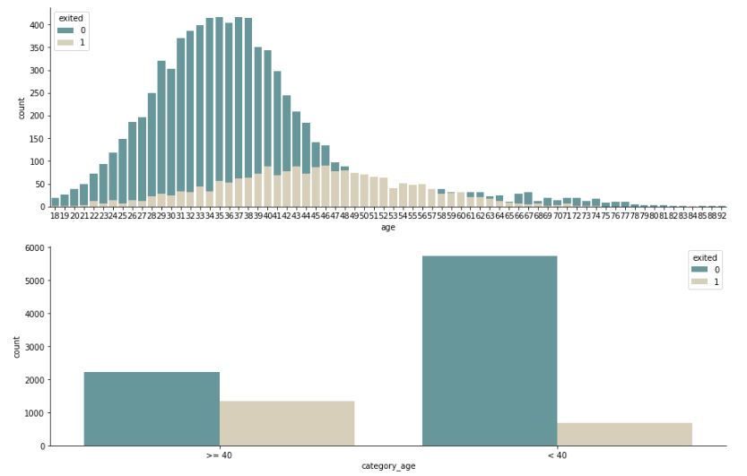
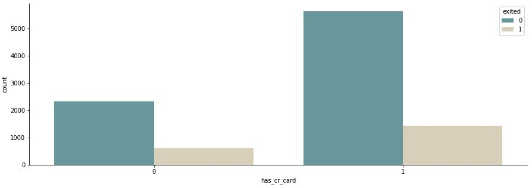
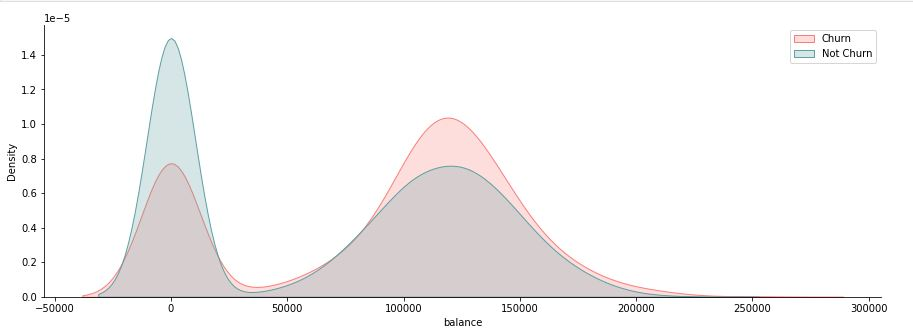

    

# Ecommerce-Customer-Churn

Previsão de Clientes em Churn.

  

# Conteúdo

<!--ts-->

1.  [Contexto do Problema](Contexto-do-Problema)
2.  [O Problema](O-Problema)
3.  [Entendimento do Problema](Entendimento-do-Problema)
4.  [Dados](Descrição-de-Dados)
5.  [Planejamento da Solução](Planejamento-da-Solução)
6.  [Hipóteses Principais](Hipóteses-Principais)
7.  [Algoritmos ML](Algoritmos-de-Machine-Learning-Aplicados)
8.  [Performace Modelos](Performace-dos-Modelos-de-Machine-Learning)
9.  [Resultados](Resultados)
10. [Entrega da Solução](#Entrega-da-Solucao)

<!--te-->

# Contexto do Problema

A TopBank é uma grande empresa de serviços bancários. Ela atua principalmente nos países da Europa oferecendo produtos financeiros, desde contas bancárias até investimentos, passando por alguns tipos de seguros e produto de investimento.

O modelo de negócio da empresa é do tipo serviço, ou seja, ela comercializa serviços bancários para seus clientes através de agências físicas e um portal online.

O principal produto da empresa é uma conta bancária, na qual o cliente pode depositar seu salário, fazer saques, depósitos e transferência para outras contas. Essa conta bancária não tem custo para o cliente e tem uma vigência de 12 meses, ou seja, o cliente precisa renovar o contrato dessa conta para continuar utilizando pelos próximos 12 meses.

Segundo o time de Analytics da TopBank, cada cliente que possui essa conta bancária retorna um valor monetário de 15% do valor do seu salário estimado, se esse for menor que a média e 20% se esse salário for maior que a média, durante o período vigente de sua conta. Esse valor é calculado anualmente.

Por exemplo, se o salário mensal de um cliente é de 1.000,00 reais e a média de todos os salários do banco é de 800,00 reais A empresa, portanto, fatura 200,00 reais anualmente com esse cliente. Se esse cliente está no banco a 10 anos, a empresa já faturou 2.000,00 reais com suas transações e utilização da conta.

Nos últimos meses, o time de Analytics percebeu que a taxa de clientes cancelando suas contas e deixando o banco, atingiu números inéditos na empresa. Preocupados com o aumento dessa taxa, o time planejou um plano de ação para diminuir taxa de evasão de clientes.

Preocupados com a queda dessa métrica, o time de Analytics da TopBottom, contratou você como consultor de Data Science para criar um plano de ação, com o objetivo de reduzir a evasão de clientes, ou seja, impedir que o cliente cancele seu contrato e não o renove por mais 12 meses. Essa evasão, nas métricas de negócio, é conhecida como Churn.

De maneira geral, Churn é uma métrica que indica o número de clientes que cancelaram o contrato ou pararam de comprar seu produto em um determinado período de tempo. Por exemplo, clientes que cancelaram o contrato de serviço ou após o vencimento do mesmo, não renovaram, são clientes considerados em churn.

Outro exemplo seria os clientes que não fazem uma compra à mais de 60 dias. Esse clientes podem ser considerados clientes em churn até que uma compra seja realizada. O período de 60 dias é totalmente arbitrário e varia entre empresas.

# O Problema

Como um Consultor de Ciência de Dados, você precisa criar um plano de ação para diminuir o número de clientes em churn e mostrar o retorno financeiro da sua solução.

Ao final da sua consultoria, você precisa entregar ao CEO da TopBottom um modelo em produção, que receberá uma base de clientes via API e retornará essa mesma base “scorada”, ou seja, um coluna à mais com a probabilidade de cada cliente entrar em churn.

Além disso, você precisará fornecer um relatório reportando a performance do seu modelo e o impacto financeiro da sua solução. Questões que o CEO e o time de Analytics gostariam de ver em seu relatório:

- Qual a taxa atual de Churn da TopBank?
- Qual a Performance do modelo em classificar os clientes como churns?
- Qual o retorno esperado, em termos de faturamento, se a empresa utilizar seu modelo para evitar o churn dos clientes?

Uma possível ação para evitar que o cliente entre em churn é oferecer um cupom de desconto, ou alguma outro incentivo financeiro para ele renovar seu contrato por mais 12 meses.

Para quais clientes você daria o incentivo financeiro e qual seria esse valor, de modo a maximizar o ROI (Retorno sobre o investimento). Lembrando que a soma dos incentivos não pode ultrapassar os R$50.000,00

# Entendimento do Problema

**Motivação:** Diminuir a taxa de Churn da empresa.

**Causa Raiz do Problema:** Estimular a compra de clientes em Churn.

**Tipo de Problema:** Classificar a propensão dos clientes entrarem em Churn.

**Potênciais Métodos:** Classificação, Rank to Learn.

**Granularidade:** Previsão de Churn por cliente.

**Entraga da Solução:** WebApp Streamlit

**Dados para Resolver o Problema**: [Kaggle](https://www.kaggle.com/mervetorkan/churndataset)

# Descrição de Dados

O Dataset usado para este projeto possui 10.000 linhas e 14 colunas. Os dados contém:

| Atributo       | Significado                                                                               |
| -------------- | ----------------------------------------------------------------------------------------- |
| RowNumber      | O número da coluna                                                                        |
| CustomerID     | Identificador único do cliente                                                            |
| Surname        | Sobrenome do cliente.                                                                     |
| CreditScore    | A pontuação de Crédito do cliente para o mercado de consumo.                              |
| Geography      | O país onde o cliente reside.                                                             |
| Gender         | O gênero do cliente.                                                                      |
| Age            | A idade do cliente.                                                                       |
| Tenure         | Número de anos que o cliente permaneceu ativo.                                            |
| Balance        | Valor monetário que o cliente tem em sua conta bancária.                                  |
| NumOfProducts  | O número de produtos comprado pelo cliente no banco.                                      |
| HasCrCard      | Indica se o cliente possui ou não cartão de crédito.                                      |
| IsActiveMember | Indica se o cliente fez pelo menos uma movimentação na conta bancário dentro de 12 meses. |
| EstimateSalary | Estimativa do salário mensal do cliente.                                                  |
| Exited         | Indica se o cliente está ou não em Churn.                                                 |

# Planejamento da Solução

**1. Descrever os Dados:**

- Carregar os dados e entender as variáveis disponíveis e verificar possíveis valores faltantes e inconsistências.
- Realizar uma estatística descritiva para entender as características dos dados.

**2. Levantar Hipóteses:**

- Criar Hipóteses sobre as características e o comportamento de clientes em Churn.
- Realizar uma Feature Engineering para criar novas variáveis.

**3. Filtrar Dados:**

- Filtrar linhas e colunas de acordo com as restrições de negócio e com as premissas assumidas.

**4. Realizar Análise Exploratória de Dados:**

- Validar ou refutar as hipóteses através dos dados.
- Identificar correlação entre variáveis e a variável resposta.
- Obter insights.

**5. Preparar os dados**

- Fazer o reescalonamento das variáveis e aplicar Encoding.

**6. Selecionar as melhores Features**

- Usar o algoritmo Extra Trees para selecionar as features mais importantes e o Boruta.

**7. Modelagem de Machine Leaning**

- Treinar, aplicar cross validation nos algoritmos e validar a partir das métrcias precision@k e recall@k.

**8. Ajustar os Hiperparametros**

- Encontrar a melhor combinação de parametros para o modelo final usando a técnica de Grid Search.

**9. Traduzir e Interpretar o erro**

- Transformar a performace de Machine Leaning para resultado de Negócio, respondendo as perguntas de negócio feitas. Econtrar a melhor porcentagem de desconto para não ultrapassar o limite estabelecido.

**10. Deploy do Modelo em Produção**

- Deixar o modelo acessível utilizando API e com acesso via webApp.

# Hipóteses Principais

### **H4.** Clientes acima de 40 anos, entram mais em Churn.

**VERDADEIRA** Clientes <ins>acima</ins> de 40 anos, entram mais em Churn.

  

### **H10.** Clientes que não possuem cartão de crédito, entram mais em Churn.

**FALSA** Clientes que <ins>possuem</ins> cartão de crédito, entram mais em Churn.

  

### **H11.** Clientes com menor saldo, entram mais em Churn.

**FALSA** Clientes com <ins>maior saldo</ins>, entram mais em Churn.

  

# Algoritmos de Machine Learning Aplicados

Os modelos treinados foram:

- Naive Bayes
- Logistic Regression
- KNN
- Random Forest
- XGBoost
- LGBM
- Combinação de Random Forest, LGBM e XGBoost.

O modelo com performance mais alta e escolhido para resolver o problema de Churn da empresa foi **Combinação de Random Forest, LGBM e XGBoost**.

# Performace dos Modelos de Machine Learning

As métricas usadas para comparação dos resultados foram: Precision @k, Recall @k curva lift e curva de ganho acumaltivo. Os resultados das performances obtidas com a validação cruzada foram:

| Model Name                         | number of K | precision @k | recall @k |
| ---------------------------------- | ----------- | ------------ | --------- |
| XGBoost CV                         | 50          | 0.968627     | 0.121258  |
| Combination (XGB, Forest, LGBM) CV | 50          | 0.968627     | 0.121257  |
| LGBM CV                            | 50          | 0.964706     | 0.120766  |
| Random Forest CV                   | 50          | 0.945098     | 0.118802  |
| Logistic Regression CV             | 50          | 0.921569     | 0.115366  |
| KNN CV                             | 50          | 0.843137     | 0.104562  |
| Naive Bayes CV                     | 50          | 0.811765     | 0.101618  |

# Resultados

- Budget de desconto aos clientes (Total): 46517.63
- Cumpom de desconto: 5%
- Lucro Antes dos gastos: 930352.57
- Lucro após os gastos: 883834.94

## Respondendo Perguntas do Negócio

### 1. Qual a taxa atual de Churn da TopBank?

- Taxa de Churn atual é de: 20.37%
  Nova taxa de Churn do banco é de: **19.88%**

### 2. Qual a Performance do modelo em classificar os clientes como churns?

- Em uma base de 2 mil clientes, ranqueando-a para 50 clientes a performance do modelo é de: 96%. Ou seja, dentro dos 50 clientes, **96% (48)** são de fato Churn.

### 3. Qual o retorno esperado, em termos de faturamento, se a empresa utilizar seu modelo para evitar o churn dos clientes?

  

# Entrega da Solução

## Arquitetura Modelo em Produção

\*\* to do

## Demonstração do Modelo

Acesse os resultados do modelo em produção e faça seus testes.

  

